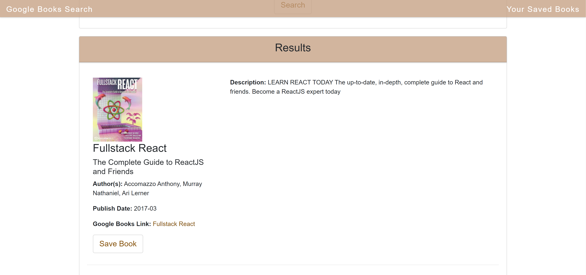
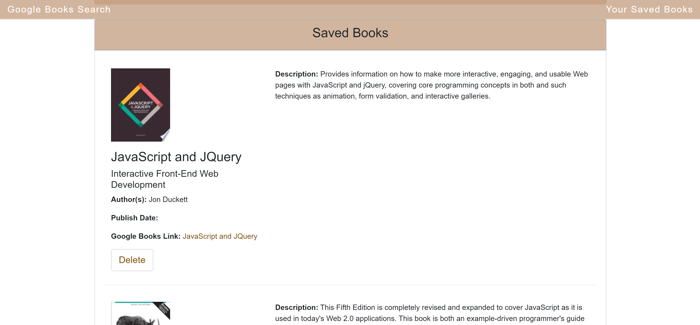

# React Google Books Search

### Overview

React-based Google Books Search app. Built to practice creating React components, work with helper/util functions, and utilize React lifecycle methods to query and display books based on user searches. Uses Node, Express and MongoDB so that users can save books to review or purchase later.

---

A working version of the application can be found at [https://google-books-search-dave.herokuapp.com/searchBooks](https://google-books-search-dave.herokuapp.com/searchBooks "Google Books Search")

---

### Instructions

* This application requires at minimum 2 pages, check out the following mockup images for each page:

  
* Search - User can search for books via the `Google Books API` and render them here. User has the option to "View" a book, bringing them to the book on Google Books, or "Save" a book, saving it to the `Mongo` database.

  
* Saved - Renders all books saved to the `Mongo` database. User has an option to "View" the book, bringing them to the book on Google Books, or "Delete" a book, removing it from the `Mongo` database.

---

1. I started the app from scratch using [Create React App](https://github.com/facebookincubator/create-react-app).

2. Add code to connect to a MongoDB database named `googlebooks` using the mongoose npm package.

3. Using mongoose, then create a Book schema.

4. At a minimum, books should have each of the following fields:

* `title` - Title of the book from the Google Books API

* `subtitle` - Subtitle of the book from the Google Books API

* `authors` - The books's author(s) as returned from the Google Books API

* `description` - The book's description as returned from the Google Books API

* `image` - The Book's thumbnail image as returned from the Google Books API

* `link` - The Book's information link as returned from the Google Books API

* `googleId` - The Book's googleId information as returned from the Google Books API

* Creating `documents` in your `books` collection similar to the following:

    ```
    {
    authors: ["David Flanagan"],
    googleId: "2weL0iAfrEMC",
    title: "JavaScript: The Definitive Guide",
    subtitle: "The Definitive Guide",
    link:
      "https://play.google.com/store/books/details?id=2weL0iAfrEMC&source=gbs_api",
    description:
      "This Fifth Edition is completely revised and expanded to cover JavaScript as it is used in today's Web 2.0 applications. This book is both an example-driven programmer's guide and a keep-on-your-desk reference, with new chapters that explain everything you need to know to get the most out of JavaScript.",
    image:
      "http://books.google.com/books/content?id=2weL0iAfrEMC&printsec=frontcover&img=1&zoom=1&edge=curl&source=gbs_api"
  }

    ```

1. Create a layout similar to the mockups displayed above. This should be a SPA (Single Page Application) that uses [`react-router-dom`](https://github.com/reactjs/react-router) to navigate, hide and show your React components without changing the route within Express.

* The layout should include at least two React Components for each page `Search` and `Saved`.

* Feel free to try out alternative CSS framework to Bootstrap.

6. Add the following Express routes for your app:

* `/api/books` (get) - Should return all saved books as JSON.

* `/api/books` (post) - Will be used to save a new book to the database.

* `/api/books/:id` (delete) - Will be used to delete a book from the database by Mongo `_id`.

* `*` (get) - Will load your single HTML page in `client/build/index.html`. Make sure you have this _after_ all other routes are defined.

* Deploy your application to Heroku once complete. **You must use Create React App** and current versions of React and React-Router-Dom for this assignment.
